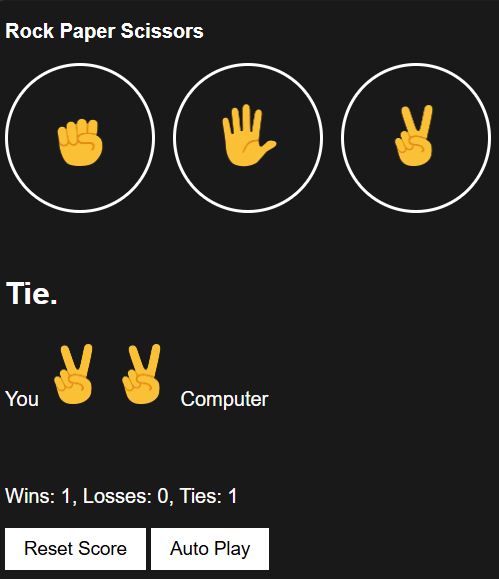

# 🪨📄✂️ Rock Paper Scissors Arena

A fun and interactive **Rock Paper Scissors game** where you can battle against the computer.  
Built using **HTML, CSS, and JavaScript** with a focus on learning core web development concepts.

---

## ✨ Features
- 🎮 **Play Mode** – Choose Rock, Paper, or Scissors and challenge the computer.  
- 🤖 **Auto Play Mode** – Let the computer play automatically every second.  
- 📊 **Score Tracking** – Wins, losses, and ties are stored in **Local Storage**, so scores persist even after refreshing.  
- 🎨 **Minimal UI** – Clean, responsive design with emoji-based icons.  
- ♻️ **Reset Option** – Reset your scores anytime with one click.  

---

## 🎮 How to Play

### 1️⃣ Manual Play
- Click on any **Rock**, **Paper**, or **Scissors** button.  
- The computer will randomly pick a move.  
- The result (**You win / You lose / Tie**) is displayed immediately.  
- Your **score updates automatically** and is stored in Local Storage.  

### 2️⃣ Auto Play
- Click the **“Auto Play”** button.  
- The game will automatically pick a random move for you every second.  
- The computer also plays its move automatically.  
- Results and score update in real-time.  
- Click **“Auto Play”** again to stop the automatic gameplay.  

> You can switch between manual play and auto-play anytime. All scores are cumulative.  
> Use the **Reset Score** button to start fresh.

---

## 📸 Screenshot Preview


---

## 🚀 Live Demo
Play the game online here: [Rock Paper Scissors Arena](https://anushareddi02.github.io/RockPaperScissor_Autoplay/)

---

## 🛠️ Tools & Technologies Used
- **HTML5** → For structuring the page and game UI.  
- **CSS3** → For styling buttons, results, and creating a clean dark theme.  
- **JavaScript (Vanilla JS)** → For all the game logic:
  - Handling player input (rock, paper, scissors).  
  - Generating computer moves using `Math.random()`.  
  - Comparing moves and deciding the winner.  
  - Updating the DOM dynamically (`innerHTML`).  
  - Implementing **Auto Play** with `setInterval()` and `clearInterval()`.  
  - Saving game state with **Local Storage (JSON.stringify & JSON.parse)**.  
- **Git & GitHub** → For version control and deploying via GitHub Pages.  

---

## 📚 Things I Learned
Through building this project, I understood:
- 🎨 How to design simple, interactive UI using **HTML & CSS**.  
- ⚡ DOM Manipulation:
  - `querySelector` to update elements dynamically.  
  - `innerHTML` to inject results & images.  
- 📦 Local Storage:
  - Saving and retrieving JSON objects.  
  - Persisting scores across page reloads.  
- ⏱️ JavaScript Timing Functions:
  - `setInterval` & `clearInterval` to build Auto Play.  
- 🧩 Game Logic Implementation:
  - Writing conditional checks for winner/loser/tie.  
- 💻 Git & GitHub:
  - Organizing project files.  
  - Writing a professional README.  
  - Deploying with **GitHub Pages** for a live demo.  

---

## ⚡ How to Access / Run
You can **play the game directly online** using the live GitHub Pages link:

🎮 **Play Now:** [Rock Paper Scissors Arena](https://anushareddi02.github.io/RockPaperScissor_Autoplay/)

Or, if you want to **run it locally**:

1. Clone this repository:
   ```bash
   git clone https://github.com/AnushaReddi02/RockPaperScissor_Autoplay.git

